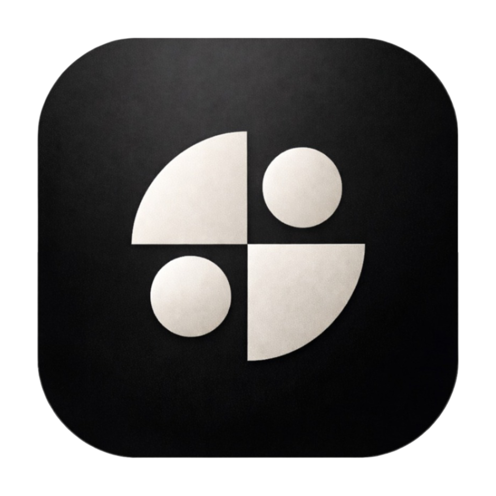

<p align="center">
  
</p>

<h1 align="center">claude-devtools (Tauri)</h1>

<p align="center">
  <strong><code>Terminal tells you nothing. This shows you everything.</code></strong>
  <br />
  A desktop app that reconstructs exactly what Claude Code did — every file path, every tool call, every token — from the raw session logs already on your machine.
</p>

<p align="center">
  <sub>Based on <a href="https://github.com/matt1398/claude-devtools">matt1398/claude-devtools</a> (Electron). This fork replaces the Electron + Node.js sidecar architecture with <strong>Tauri 2.x + Rust</strong> for a faster, lighter native experience.</sub>
</p>

---

## What Changed from the Original

The [original claude-devtools](https://github.com/matt1398/claude-devtools) uses Electron with a Node.js/TypeScript backend (sidecar HTTP server). This fork:

- **Replaced Electron with Tauri 2.x** — smaller binary, lower memory usage, native OS integration
- **Ported the entire backend to Rust** — file watching (`notify` crate), JSONL parsing (`serde_json`), project scanning, chunk building, config management, notification triggers, and SSH support (`russh`) — all run natively without a Node.js runtime
- **Removed the sidecar** — the frontend communicates directly with Rust via Tauri `invoke()` commands and events, no intermediate HTTP server
- **Switched to bun** as the JavaScript package manager and task runner
- **Switched to oxlint/oxfmt** for linting and formatting

---

## Why This Exists

Recent Claude Code updates replaced detailed tool output with opaque summaries. `Read 3 files`. `Searched for 1 pattern`. `Edited 2 files`. No paths, no content, no line numbers.

**There is no middle ground in the CLI.** You either see too little or too much.

claude-devtools reads the raw session logs from `~/.claude/` and reconstructs the full execution trace: every file path that was read, every regex that was searched, every diff that was applied, every token that was consumed — organized into a visual interface you can actually reason about.

It doesn't wrap or modify Claude Code at all. It works with every session you've ever run — terminal, IDE, or any other tool.

---

## Key Features

### Visible Context Reconstruction

Claude Code doesn't expose what's actually in the context window. claude-devtools reverse-engineers it — per-turn token attribution across categories: CLAUDE.md files, skill activations, @-mentioned files, tool I/O, extended thinking, team coordination, and user text. Includes compaction visualization showing how context fills, compresses, and refills.

### Custom Notification Triggers

Define rules for system notifications. Match on regex patterns against file paths, commands, prompts, content, or thinking. Built-in defaults for `.env` access, tool errors, and high token usage. Scope triggers to specific repositories.

### Rich Tool Call Inspector

Every tool call is paired with its result in an expandable card:
- **Read** calls show syntax-highlighted code with line numbers
- **Edit** calls show inline diffs with added/removed highlighting
- **Bash** calls show command output
- **Subagent** calls show the full execution tree, expandable in-place

### Team & Subagent Visualization

Subagent sessions rendered as expandable inline cards with their own metrics. Teammate messages shown as color-coded cards. Full team lifecycle visibility: TeamCreate, TaskCreate/TaskUpdate, SendMessage, TeamDelete.

### Command Palette & Cross-Session Search

**Cmd+K** for Spotlight-style search across all sessions in a project with context snippets and highlighted keywords.

### SSH Remote Sessions

Connect to remote machines over SSH and inspect Claude Code sessions there. Parses `~/.ssh/config`, supports agent forwarding, private keys, and password auth via `russh`.

### Multi-Pane Layout

Open multiple sessions side-by-side. Drag-and-drop tabs between panes, split views, and compare sessions in parallel.

---

## What the CLI Hides vs. What claude-devtools Shows

| What you see in the terminal | What claude-devtools shows you |
|------------------------------|-------------------------------|
| `Read 3 files` | Exact file paths, syntax-highlighted content with line numbers |
| `Searched for 1 pattern` | The regex pattern, every matching file, and the matched lines |
| `Edited 2 files` | Inline diffs with added/removed highlighting per file |
| A three-segment context bar | Per-turn token attribution across 7 categories with compaction visualization |
| Subagent output interleaved with the main thread | Isolated execution trees per agent with their own metrics |
| Teammate messages buried in session logs | Color-coded teammate cards with full team lifecycle visibility |
| Critical events mixed into normal output | Trigger-filtered notification inbox |
| `--verbose` JSON dump | Structured, filterable, navigable interface |

---

## Tech Stack

| Layer | Technology |
|-------|-----------|
| Desktop framework | Tauri 2.x |
| Backend | Rust (serde, notify, russh, tokio) |
| Frontend | React 18, TypeScript 5, Tailwind CSS 4, Zustand 5 |
| Package manager | bun |
| Linting/Formatting | oxlint, oxfmt |
| Testing | Vitest |

---

## Development

### Prerequisites

- [Rust](https://rustup.rs/) (stable)
- [bun](https://bun.sh/)
- Tauri 2.x system dependencies ([see Tauri docs](https://v2.tauri.app/start/prerequisites/))

### Setup

```bash
git clone https://github.com/stevenevan/claude-devtools-tauri.git
cd claude-devtools-tauri
bun install
bun run dev
```

The app auto-discovers your Claude Code projects from `~/.claude/`.

### Scripts

| Command | Description |
|---------|-------------|
| `bun run dev` | Development with hot reload |
| `bun run build` | Production build (Tauri) |
| `bun run typecheck` | TypeScript type checking |
| `bun run lint:fix` | Lint and auto-fix |
| `bun run format` | Format code |
| `bun run test` | Run all tests |
| `bun run test:watch` | Watch mode |
| `bun run test:coverage` | Coverage report |
| `bun run check` | Full quality gate (types + lint + test + build) |

---

## Contributing

See [CONTRIBUTING.md](CONTRIBUTING.md) for development guidelines.

## Security

Tauri commands validate all inputs with strict path containment checks. File reads are constrained to the project root and `~/.claude`. See [SECURITY.md](SECURITY.md) for details.

## Acknowledgments

This project is based on [claude-devtools](https://github.com/matt1398/claude-devtools) by [@matt1398](https://github.com/matt1398). The original project provided the foundation for session log parsing, chunk building, and the overall UI design.

## License

[MIT](LICENSE)
